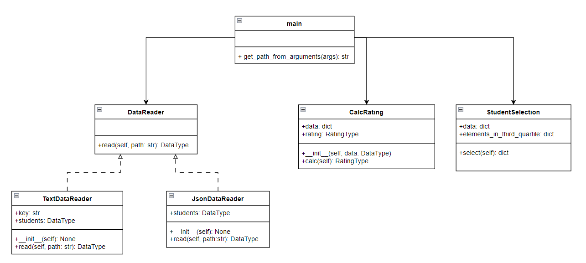

# PTLab1
Лабораторная работа №1 по дисциплине "Технологии программирования"

## Постановка задачи
Знакомство с системой контроля версий Git и инструментом CI/CD GitHub Actions

Задание по варианту №11:

- Формат входного файла: JSON
- Определить и вывести на экран всех студентов, чей
рейтинг попадает в третью квартиль распределения по
рейтингам.  

## Описание проекта
Проект включает в себя следующие компоненты:
- Скрипты для чтения данных из файлов разных форматов.
- Вычисление рейтингов студентов на основе их оценок.
- Анализ студентов, попадающих в третиль квартиль.
- Тесты для проверки функциональности скриптов.
  
## Используемые языки / библиотеки / технологии
- Python 3.x
- Библиотеки: pytest, pycodestyle, json

## UML-диаграмма классов

## Выводы

В ходе выполнения работы были изучены основные инструментами разработки программного обеспечения, такие как система контроля версий Git, непрерывная интеграция и развертывание, ООП-программирование и модульное тестирование. Также были изучены использование инструмента GitHub Actions для управления автоматизированным тестированием ПО. В результате работы была разработана система для анализа студенческих оценок, вычисления рейтингов и выявления студентов в третьем квартиле.
